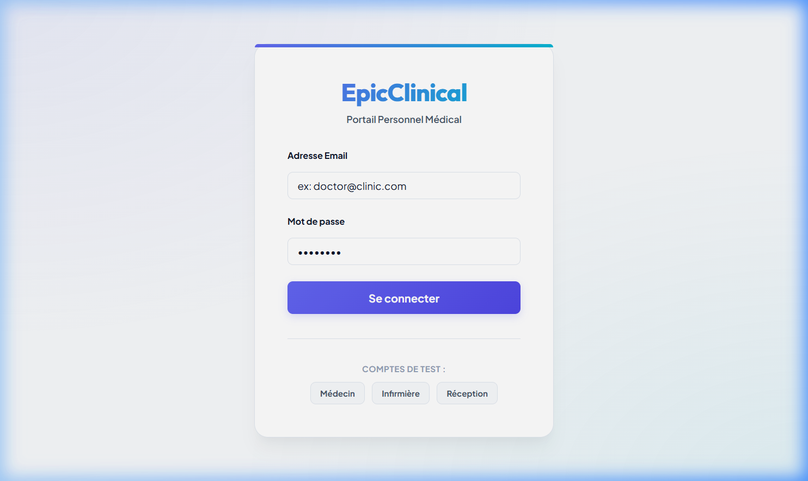
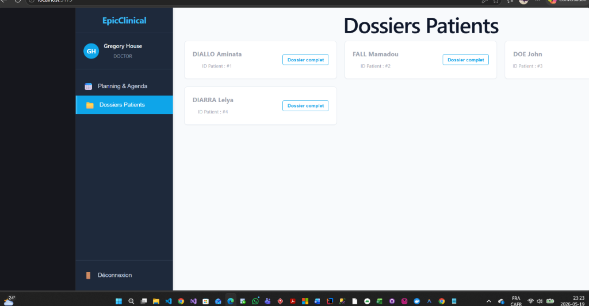
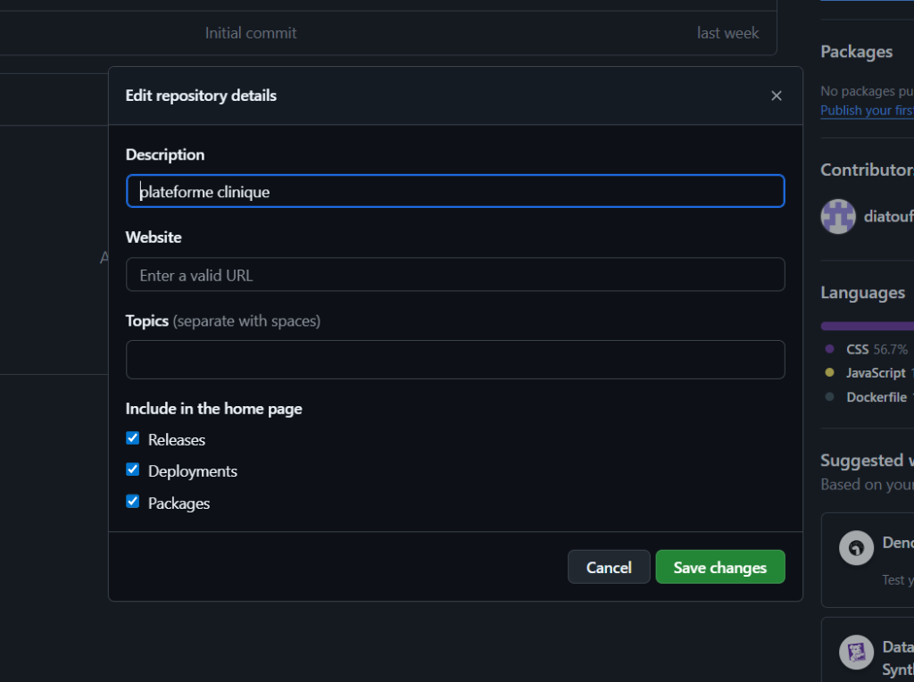

# EpicClinical Web — Portail de Dossiers Patients & Agenda Médical Fullstack

EpicClinical Web est un portail EHR (Electronic Health Record) sécurisé et performant facilitant le suivi des patients et la planification des rendez-vous médicaux pour les cliniques médicales.

---

## Le Plan Réalisé (Roadmap Technique)

Toutes les étapes du projet ont été complétées avec succès :
1. **Étape 1 : Fondations et Architecture** ✅ (React, Node.js, Express, PostgreSQL, Docker)
2. **Étape 2 : Authentification et Sécurité (RBAC)** ✅ (Gestion des Rôles : Médecin, Infirmier, Réceptionniste)
3. **Étape 3 : Agenda de la Clinique** ✅ (Prise, modification et annulation sécurisée de rendez-vous)
4. **Étape 4 & 4.5 : Dossiers Patients Clinique & Archivage** ✅ (Coordonnées complètes, archivage conforme et sécurité HIPAA)
5. **Étape 5 & 6 : Notes Cliniques & Prescriptions** ✅ (Timeline des visites et gestion d'ordonnances)
6. **Étape 8 : Refonte Visuelle et Design Premium** ✅ (Polices Google Fonts, thème Indigo/Cyan, micro-animations, verre dépoli)

---

## 📸 Aperçu de l'Application

Voici un aperçu visuel de l'interface moderne et réactive de la plateforme :

### 1. Page de Connexion (Authentification Sécurisée)

### 2. Agenda Clinique (Planning & Rendez-vous)

### 3. Gestion des Dossiers Patients (Liste Épurée & Recherche)

---

## 🛠️ Détail des Étapes Réalisées

### Étape 1 : Initialisation & Architecture
- **Frontend** : Application construite avec **React** et **Vite** pour un affichage rapide et dynamique.
- **Backend** : Serveur API avec **Node.js** et **Express** pour traiter les requêtes métiers.
- **Base de données** : **PostgreSQL** hébergé dans un conteneur **Docker** pour isoler et faciliter l'installation du système de stockage de données.

---

### Étape 2 : Sécurité et Gestion des Accès (Rôles & RBAC)
Nous avons mis en place une gestion des utilisateurs basée sur les rôles (Role-Based Access Control) sécurisée par des jetons **JWT** (JSON Web Tokens).
- **Médecin (DOCTOR)** : Accès en lecture seule sur l'agenda global, droit de consulter et d'éditer les dossiers cliniques complets (notes et prescriptions).
- **Infirmière (NURSE)** : Droit de consulter les rendez-vous et d'ajouter des observations de base.
- **Réceptionniste (RECEPTIONIST)** : Gestion complète du planning et de l'agenda, création de dossiers patients. Interdiction absolue d'accéder aux informations médicales sensibles.

---

### Étape 3 : Agenda et Planification
- Un calendrier d'agenda clinique répertorie les rendez-vous de la journée.
- **Sécurité métier** : Seul le réceptionniste peut créer et annuler des rendez-vous. Le médecin et le réceptionniste peuvent valider qu'un rendez-vous est terminé.

---

### Étape 4 & 4.5 : Fiche Patient Détaillée & Système d'Archivage
- **Champs démographiques** : Ajout du numéro de téléphone, de l'adresse email et de l'adresse de domicile pour chaque patient.
- **Système d'Archivage (Sortie du système)** : Pour respecter les réglementations médicales (non-destruction définitive immédiate des données de santé), un patient n'est pas "supprimé" mais **archivé** (statut `ARCHIVED`).
- Les dossiers archivés sont isolés dans un filtre spécial ("Afficher les dossiers archivés"), grisés visuellement, et peuvent être restaurés en un clic si nécessaire.
- **Conformité HIPAA** : Si un réceptionniste tente de cliquer sur le "Dossier complet" (médical) d'un patient, un écran d'interdiction HIPAA moderne s'affiche pour bloquer l'accès.

---

### Étape 5 & 6 : Notes de Consultation et Ordonnances
- Les médecins peuvent rédiger des notes cliniques qui s'affichent sous forme de **Timeline** chronologique.
- Ajout d'un système de prescriptions médicales permettant de renseigner le médicament, la posologie, et les détails de l'ordonnance.

---

### Étape 8 : Refonte Visuelle & Thème Premium
- **Polices Premium** : Utilisation de `Outfit` pour les titres (rendu géométrique moderne) et `Plus Jakarta Sans` pour les textes.
- **Transitions & Survol** : Effets de translation discrète sur les cartes, boutons arrondis soignés et surbrillances colorées.
- **Superpositions Modernes** : Utilisation de `backdrop-filter: blur(8px)` pour donner un aspect de verre dépoli aux modaux.
- **Contraste de sécurité** : Colorisation forcée des formulaires de saisie en fond blanc et texte sombre pour éliminer tout risque d'écriture invisible.

---

## 💡 Préparation aux Entretiens

Pour vous préparer à expliquer les détails techniques de ce projet (sécurité RBAC, choix de base de données PostgreSQL, archivage logique/HIPAA, etc.) lors d'entretiens de recrutement, un guide complet de questions/réponses est disponible dans le fichier dédié :
👉 **[Guide de Préparation aux Entretiens](file:///c:/Users/hp/Desktop/clinical-platform/PREPARATION_ENTRETIEN.md)**
